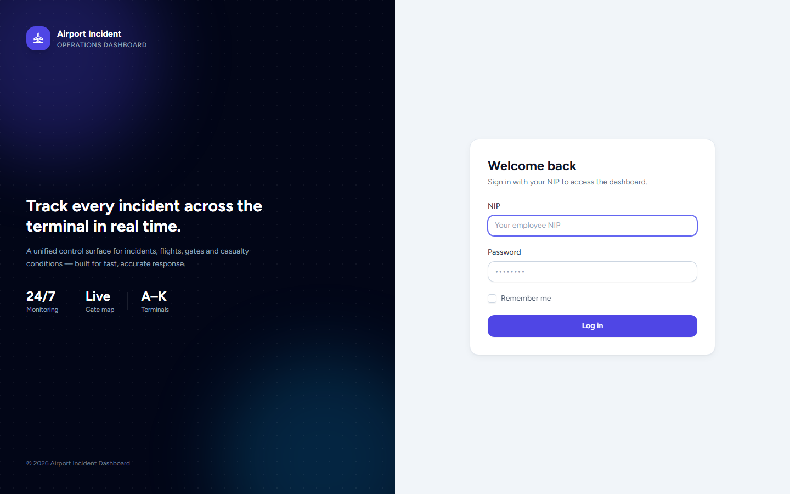
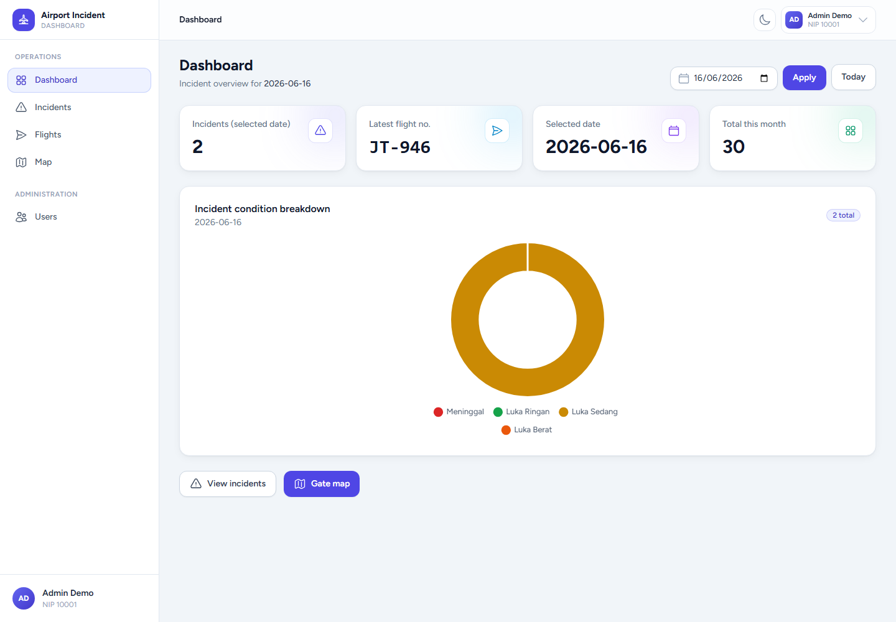
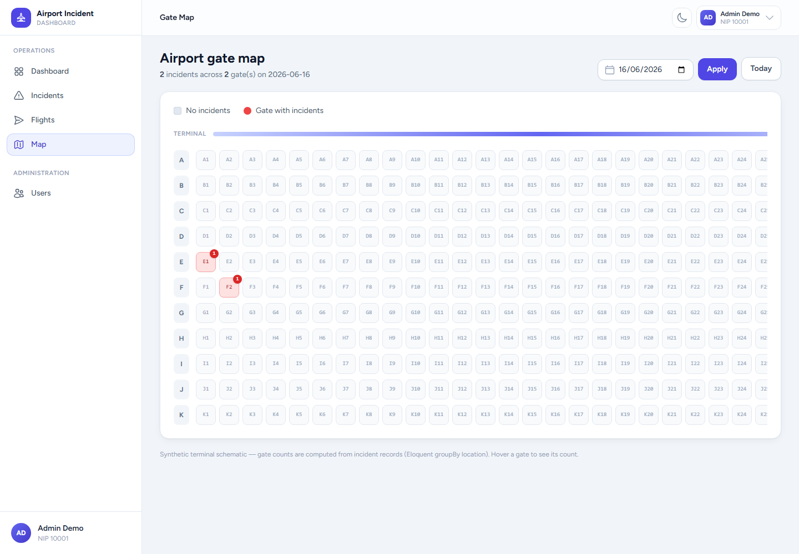

# Airport Incident Dashboard

> A Laravel 11 operations dashboard for logging, tracking, and visualizing airport casualty incidents — with NIP-based authentication, role-based access control, interactive charts, and a gate-level incident map.

Built as a modern rewrite of a legacy procedural PHP system: the same domain (incident logging across airport gates) re-implemented on Laravel 11 with Eloquent, FormRequest validation, RBAC middleware, a dark-mode Tailwind UI, and a full Pest test suite.

---

## Screenshots

| Login | Dashboard | Incident Map |
| --- | --- | --- |
|  |  |  |

---

## Features

- **NIP-based authentication** — login by employee number (NIP) + password, with login throttling (5 attempts) and session regeneration. Accounts are provisioned by an administrator; there is no public registration.
- **Role-based access control (RBAC)** — `admin` and `operator` roles enforced by a custom `role` middleware. Admins manage users; operators log and review incidents.
- **Incident logging** — create incidents singly or in bulk, with validated casualty condition (`meninggal`, `ringan`, `sedang`, `berat`), gate/location, hospital, and flight number.
- **Flight management** — companion CRUD for flight records.
- **Analytics dashboard** — doughnut chart breakdown by casualty condition (Chart.js) with date filtering, plus JSON drill-down endpoints.
- **Gate-level incident map** — per-gate incident counts for a selected date.
- **User management** — admin-only CRUD; password hashes are never exposed in responses.
- **Modern UI** — Tailwind CSS + Alpine.js, responsive, with a polished dark mode and toast notifications.

---

## Tech Stack

| Layer | Technology |
| --- | --- |
| Framework | Laravel 11.x (PHP 8.2+) |
| Auth / Scaffolding | Laravel Breeze (Blade), customized for NIP login |
| Database | SQLite (zero-config default) · MySQL 8 (Docker) |
| Frontend | Blade, Tailwind CSS, Alpine.js, Chart.js |
| Build | Vite |
| Testing | Pest (38 tests) |
| Tooling | Laravel Pint, Composer, npm |

---

## Quick Start

Requirements: PHP 8.2+, Composer, Node 18+ and npm.

```bash
# 1. Install dependencies
composer install
npm install && npm run build

# 2. Environment
cp .env.example .env
php artisan key:generate

# 3. Database (SQLite is the zero-config default)
php artisan migrate --seed

# 4. Serve
php -S 127.0.0.1:8000 -t public
#   ...or, if available:
php artisan serve
```

Then open <http://127.0.0.1:8000>.

> The seeder creates a `database/database.sqlite` file automatically via the migration step. If you prefer, create it manually with `touch database/database.sqlite` before migrating.

### Demo Credentials

After `php artisan migrate --seed`, log in with the seeded accounts (login is by **NIP**, not email):

| Role | NIP | Password |
| --- | --- | --- |
| Admin | `10001` | `password` |
| Operator | `10002` | `password` |

All seeded names and incident data are synthetic (Faker `id_ID`). There is no real personal data in this repository.

---

## Run with Docker

A production-style container stack (PHP 8.3-FPM + nginx + MySQL 8) ships with the repo:

```bash
docker compose up --build
# open http://localhost:8080
```

On first boot the app waits for MySQL, runs migrations, and (with `SEED_ON_START=true`) seeds the demo data. Set a real `APP_KEY` for non-throwaway deployments:

```bash
php artisan key:generate --show   # copy into APP_KEY in your environment
```

SQLite remains the zero-config option for local development outside Docker.

---

## Architecture

- **Eloquent models** — `User`, `Incident`, `Flight` with typed casts; the `IncidentCondition` PHP enum centralizes allowed values, display labels, and chart/badge styling.
- **FormRequest validation** — every write path (`StoreIncidentRequest`, `UpdateIncidentRequest`, `StoreFlightRequest`, `StoreUserRequest`, `LoginRequest`, …) validates input at the framework boundary; controllers stay thin.
- **RBAC middleware** — `EnsureUserHasRole` (`role:admin`) guards user management; admins implicitly pass all role checks.
- **Auth** — NIP + password via a customized Breeze `AuthenticatedSessionController` and `LoginRequest` with rate limiting and session regeneration. Email-dependent Breeze flows (registration, password reset, email verification, password confirmation) are intentionally removed.
- **Frontend** — server-rendered Blade enhanced with Alpine.js for interactivity and Chart.js for analytics, styled with Tailwind (dark mode first).
- **Tests** — 38 Pest feature tests cover auth, RBAC, incident/flight CRUD, dashboard, map, and user management.

See [ARCHITECTURE.md](ARCHITECTURE.md) for more detail.

### From legacy PHP to Laravel

This project re-implements a legacy procedural PHP app (raw SQL, mixed logic-and-markup, no auth layer) as a structured Laravel 11 application: routing and controllers replace ad-hoc scripts, Eloquent and migrations replace hand-written SQL, FormRequests replace inline `$_POST` checks, Blade components replace echoed HTML, and a Pest suite replaces manual testing. The original Indonesian domain vocabulary (NIP, casualty conditions) is preserved.

---

## Testing

```bash
php artisan test     # 38 Pest tests
npm run build        # production asset build
```

---

## License

Released under the [MIT License](LICENSE). Copyright (c) Riyadh Lakadimu.
